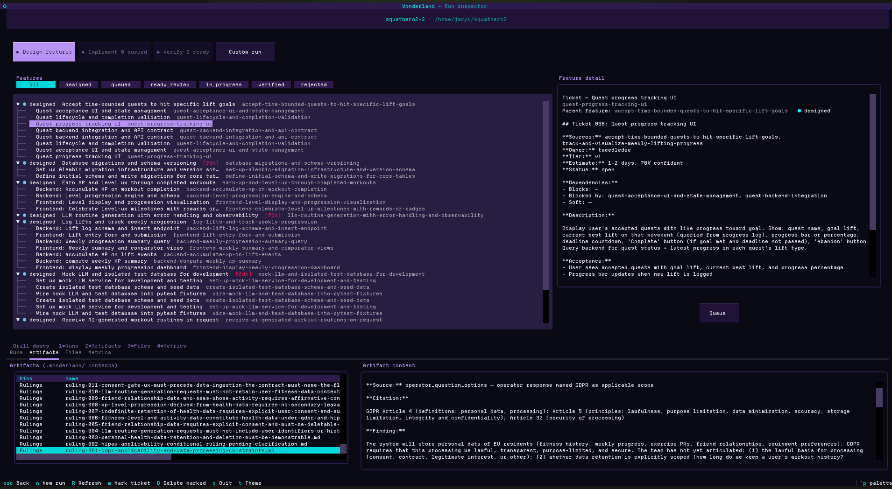

# Wonderland

**An identity-native multi-agent system that runs the full software development lifecycle — discovery → planning → design → implementation → verification — as a cast of characters who carry the project across sessions.**

> Generic AI agents perform roles. Identity-native agents inhabit them.



## The paper

**[Drink Me: Identity Engineering as Substrate for Multi-Agent SDLC](./paper/drink-me.md)** — first public draft (~80–90 arXiv pages). Documents the substrate architecture, the unified architectural claim, the iteration-cycle methodology, five pillars of evidence, an honest limitations chapter, and a pre-registered future-work commitment list.

Companion appendices:

- [Appendix A — Architecture full walkthrough](./paper/appendix-A-architecture-full.md)
- [Appendix B — Cast full registry](./paper/appendix-B-cast-full.md)
- [Appendix C — Caterpillar comparator experiment (pre-registered)](./paper/appendix-C-caterpillar-comparator-experiment.md)

## See it in action

[**mvp-demo-redux**](./analyses/046-mvp-redux-cost-receipt.md) re-ran the original notebook-app pilot on the post-substrate-fix stack: same spec, same model, **$30.58 vs the original $83.78** — a 63% cost reduction with the working app preserved (CRUD + search + tag filter functional, 22/22 backend tests passing, frontend builds clean). Pilot artifacts at [`demo/mvp-redux/`](./demo/mvp-redux/); original baseline at [`demo/mvp/`](./demo/mvp/) for direct comparison.

For the prior baseline that established Tier 2 pilots, see [mvp-demo2 — first end-to-end Tier 2 autonomous pilot](./src/wonderland/closet/analyses/034-mvp-demo2-autonomous-pilot.md). For the earlier single-directive demo of one-shot code generation, see [the Geocities pilot](./SHOWCASE.md).

## What it is

Wonderland is a cast of agents — each named after an Alice-in-Wonderland character — that collaborate across the entire software production pipeline. The Cheshire Cat is the architect. The White Rabbit is the project manager. The Mad Hatter is QA. Alice inhabits personas to write stories the team designs against. The Tweedles ship code; the Caterpillar reviews it. Every character has a stable self-model (a "constitution"), persistent per-agent memory, and a working relationship with the others.

The earlier framing was "multi-agent development system" — a fair description when the entry surface was `directive in → features out`. The project has since grown into **an end-to-end emulation of how a small software team actually produces shipping product**: a discovery phase that interviews the operator about personas and scope, a planning phase that organizes the captured requirements into sequenced milestones, then per-milestone design and implementation passes that close coverage loops the substrate verifies. The Wonderland-flavored part is unchanged — identity still does the work — but the surface the operator interacts with is now the flow, not the meeting.

The architectural claim is that **identity does real work**. An agent with a constitution it inhabits across many threads behaves differently from an agent reconstructed from a system prompt each turn. It accumulates judgment. It develops calibrated views of its colleagues. It refuses to cross domain boundaries because the boundary is part of who it is, not a policy applied from outside.

The paper develops a unified claim at two scales: identity engineering as organizing principle (global) produces a measurable constraint→quality+cost coupling (local), because they're the same fact viewed at different magnifications. Six corollaries follow:

1. **Identity-based architecture lets smaller models outperform their expected capabilities.** A small model acting in character can hold its own against a large model with a generic prompt.
2. **Failure modes are part of identity.** Each constitution's §VIII names the specific shadow each virtue decays into — Sephirah/Qlipha pairing; corruption is structural rather than additive.
3. **Character-shaped agents degrade visibly rather than silently.** When the system fails, agents notice the contradiction and reach for alternatives instead of producing silent garbage.
4. **The team produces a small-team shape, including things the directive never asked for** — ADRs with named tradeoffs, persona-grounded specs, accessibility coverage that wasn't requested.
5. **Friction is the substrate, not the inefficiency.** Every meeting is engineered friction with a specific shape; §VIII puts that friction inside each constitution.
6. **Substrate constraint amplifies identity.** Every substrate primitive shipped that narrowed agent grammar improved output AND lowered cost — quality and cost move together rather than against each other.

Full argument with per-corollary mechanics in [THESIS.md](./THESIS.md); paper-grade development in [the paper](./paper/drink-me.md).

The framing the project is building around: *failures are how software gets built.* The iterative cycle of ship-then-discover-then-fix depends on recognizing what went wrong; agents whose failure modes are part of their identity can participate in that cycle as colleagues, not as tools that need supervising out of their bad habits.

## How it works end-to-end

The operator's flow through Wonderland mirrors the four-phase arc of an actual software project, with each phase grounded in the previous one's artifacts:

1. **Discovery** — Alice, Cheshire Cat, and White Rabbit each run a short interview (personas, technical constraints, scope + success criteria). The substrate writes the answers to disk as structured ``requirement`` artifacts. The whole loop is ~12 minutes of operator attention; every later workflow seeds from this corpus rather than re-asking what the project is for.
2. **Planning** — the ``milestone-plan`` workflow organizes the captured requirements into 3–7 ordered milestones, each declaring ``consumes_requirements`` + ``done_when`` criteria. A substrate-level coverage check runs at end of each rotation: any decomposable requirement not assigned to a milestone fires a synthetic Dodo observation nudging the team to revise.
3. **Design (per milestone)** — ``tdd-design --milestone <slug>`` composes stories from the milestone's requirements (M1), turns them into features (M2), decomposes features into tickets (M3), negotiates architecture (M4) and per-feature contracts (M5). M2 runs its own coverage check verifying every milestone requirement is realized by a feature before the meeting closes.
4. **Implementation (per ticket)** — ``tdd-implement`` opens per-ticket meetings where the Tweedles write red tests, ship code that turns them green, and the Caterpillar reviews the diff. The working tree IS the implementation artifact; review is against `git diff`, not a parallel metadata utterance.

Cross-cutting through all four phases: agents can ``retract`` artifacts they shipped earlier when they realize they drifted off-scope. A workflow-level kill-list blocks speech_acts from leaking between phases (e.g., a stray ``milestone_plan`` utterance during ``tdd-design`` is silently stripped). The project dashboard derives the current phase from disk and surfaces the next-recommended workflow as a one-line CTA.

See [`projects/discovery2/.wonderland`](./projects/discovery2) (or any of the discovery* projects) for the actual artifact shapes the team produces.

## Status

In-progress, building in public. The substrate has shipped three completed Tier 2 autonomous pilots producing working full-stack applications on Haiku 4.5; the cost trajectory is monotonically downward across the substrate's iteration history. The vertical slice through discovery → planning → design → implementation is operational; a P7 generic-baseline eval is the load-bearing remaining experimental commitment named in the paper. The pre-registered next-pilot commitments (directive-shape transfer, cold-review-on-redux, one-sentence-directive pilot, ChatDev head-to-head) are documented in the paper's §9.

For the full build history, see [`analyses/`](./analyses) (numbered chronologically) and `git log` — each substrate fix shipped with a numbered analysis or a commit message naming what surfaced and what changed.

## Try it

Two demo scripts run live against the Anthropic API. You'll need an API key (see *Configuration* below).

```bash
# A single Cheshire Cat reflecting on a directive
uv run python scripts/cat_demo.py

# Cat + Rabbit on the same bus, with optional compaction afterward
uv run python scripts/two_agent_demo.py --compact
```

Both scripts publish a translation-chat directive by default; pass `--directive "..."` to use your own.

## The TUI

`wonderland-tui` is the operator interface. Register a project, queue features for the team, watch them work in real time, verify or reject what they ship. The same screen that renders live runs also replays past ones at compressed clock time, so iterating on the UX never costs API tokens.

```bash
pip install wonderland-ai
wonderland-tui
```

First-run flow: open Settings, paste an Anthropic API key (saved to your platform's user-config dir), back out. Press `n` to create a project — pick a path, pick a skeleton (`python-tui`, `python-cli`, `python-fastapi`, `react-vite`, `fullstack-fastapi-react`), optionally seed the project's prime directive from a demo preset. On confirm, the TUI offers to launch the discovery workflow immediately.

The main screens you'll meet: **project library** (your projects with metadata), **new project** (composer + skeleton picker), **per-project dashboard** (phase badge + milestones tree + features pane with state filter chips + Runs row + state-aware action buttons), **new run composer** (preset picker + directive editor + workflow / budget config), **live-watch screen** (three focusable lazygit-style panes: meetings ribbon, transcript table, artifacts), **interview modal** (during discovery — wall-clock unbounded), **operator-question modal** (when an agent surfaces architectural ambiguity it can't resolve), **cast view** (character bios + constitutions side-by-side), **settings** (API key + model). Vim navigation throughout (`j`/`k`/`g`/`G`/`Tab`/`Esc`); `t` cycles through four Wonderland-flavored palettes.

The replay-first design carries forward: drives the smoke tests, keeps UX iteration free of API spend, and means anyone curious about how the framework actually behaves can `wonderland-tui` → open a project → drill into Runs → press `w` on a snapshot to watch a captured run play back at 5× speed.

## Project layout

```
wonderland-ai/
├── paper/                  # Drink Me + paper-shaped appendices
├── THESIS.md               # Long-form thesis (architectural claim + corollaries)
├── WONDERLAND_SPEC.md      # The design document
├── constitutions/          # Each character's identity, version-controlled
├── src/wonderland/         # The runtime
│   ├── closet/             # Data the team reaches for at runtime
│   │   ├── skeletons/      # Project skeletons the team builds on top of
│   │   └── workflows/      # Meeting-chain templates (canonical, tdd, smoke)
│   └── ...                 # agent.py, runner.py, caucus.py, workflow.py, ...
├── scripts/                # Demo scripts; workflow_demo.py runs any bundled workflow
├── analyses/               # Field notes on the thesis as it gets stress-tested
├── tests/
└── .daedalus/              # Daedalus' working memory for this project
```

A target project that runs Wonderland gets a `.wonderland/` directory of its own — per-agent episodic/semantic/relational memory plus the artifacts the team produces across the lifecycle: requirements (from discovery), milestones (from planning), stories, features, tickets, ADRs, contract notes, test scenarios, implementations, reviews. The runtime here is project-agnostic; per-project state lives with the project.

```bash
wonderland init [path]   # create the .wonderland/ skeleton; idempotent
```

`init` creates `requirements/`, `milestones/`, `stories/`, `features/`, `tickets/`, `architecture/`, `escalations/`, and `memory/` plus a README documenting the layout. Re-running is safe — existing artifacts and a user-edited README are left alone.

## Install

Distribution name on PyPI is `wonderland-ai`; the import path stays `import wonderland`. Core install includes the TUI (the primary user-facing surface) and the in-process bus:

```bash
pip install wonderland-ai           # core + TUI
pip install 'wonderland-ai[redis]'  # adds RedisCaucus
```

`RedisCaucus` requires the `redis` extra; constructing one without it raises `ImportError` with an install hint.

## Configuration

Wonderland reads user-level config (API keys, model overrides) from a JSON file at the platform-appropriate location:

| OS      | Path                                                          |
|---------|---------------------------------------------------------------|
| Linux   | `~/.config/wonderland/config.json` (honors `XDG_CONFIG_HOME`) |
| macOS   | `~/Library/Application Support/wonderland/config.json`        |
| Windows | `%APPDATA%\wonderland\config.json`                            |

```json
{
  "anthropic": {
    "api_key": "sk-ant-...",
    "model": "claude-haiku-4-5-20251001"
  }
}
```

API-key resolution order: explicit constructor arg → `ANTHROPIC_API_KEY` env var → config file. The env var wins if set.

## Development

```bash
uv sync --extra dev   # includes redis for full test coverage
uv run pytest
uv run ruff check
uv run ruff format
```

Live LLM tests are gated behind `WONDERLAND_LLM_SMOKE=1` and skipped otherwise; running them costs Anthropic API tokens. Redis-backed tests are gated behind `WONDERLAND_REDIS_URL`. To exercise both:

```bash
docker run -d --name wonderland-redis -p 6379:6379 redis:7-alpine
WONDERLAND_REDIS_URL=redis://localhost:6379 \
WONDERLAND_LLM_SMOKE=1 \
  uv run pytest
```

## Sponsoring

Wonderland runs on a personal Anthropic budget — one person, one API key. The architecture is designed to be cheap (small models, heavy caching) but multi-agent runs at scale still add up. If any of my work has been useful to you — to read, build on, or argue with — [GitHub Sponsors](https://github.com/sponsors/KohlJary) keeps the Cheshire Cat in tea and the Hatter in scenarios.

## License

[MIT](./LICENSE).
